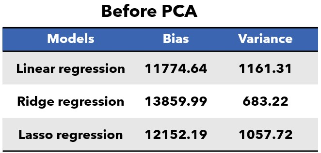
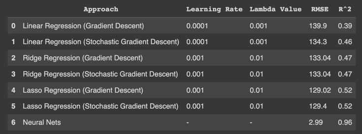
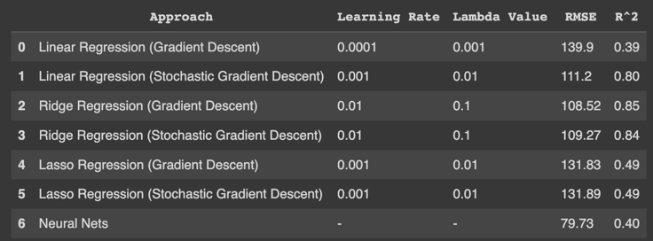

# Appliance Energy Prediction

Predict the energy consumed by appliances using custom-coded Machine Learning models and Algorithms like PCA, Neural Networks, Lasso, Ridge, and Linear Regression.

## Table of Contents
- [Introduction](#introduction)
- [Abstract](#abstract)
- [Problem Statement](#problem-statement)
- [Aim](#aim)
- [Data Description](#data-description)
- [Exploratory Data Analysis](#exploratory-data-analysis)
  - [Null Value Check](#null-value-check)
  - [Target Variable](#target-variable)
  - [Outlier Detection](#outlier-detection)
  - [Outlier Detection on Input Variables](#outlier-detection-on-input-variables)
  - [Input Variable Correlation](#input-variable-correlation)
  - [Mean Energy Consumption by Day of Week](#mean-energy-consumption-by-day-of-week)
  - [Mean Energy Consumption by Hour of Day](#mean-energy-consumption-by-hour-of-day)
  - [Mean Energy Consumption by Weekday and Week of Month](#mean-energy-consumption-by-weekday-and-week-of-month)
- [Data Preprocessing](#data-preprocessing)
  - [Feature Engineering](#feature-engineering)
  - [Data Normalization](#data-normalization)
  - [Encoding](#encoding)
  - [Test Train Split](#test-train-split)
  - [Feature Scaling](#feature-scaling)
  - [Principal Components Analysis (PCA)](#principal-components-analysis-pca)
- [Model Implementation](#model-implementation)
  - [Linear Regression](#linear-regression)
  - [Ridge Regression](#ridge-regression)
  - [Lasso Regression](#lasso-regression)
  - [Neural Network](#neural-network)
- [Results](#results)
- [Bias-Variance Tradeoff](#bias-variance-tradeoff)
- [Results Summary](#results-summary)
- [Conclusion](#conclusion)
- [Findings](#findings)
- [Future Scope](#future-scope)

## Introduction
The Appliances Energy Prediction dataset includes variables related to home appliances, weather patterns, and other environmental elements. Its main goal is to predict a household's energy usage based on the input features. Each instance in the dataset represents 10 minutes, totaling more than 19,735 instances. The information was collected over 4.5 months. The primary objective is for Machine Learning research to create and evaluate models for energy prediction tasks that can help optimize energy utilization.

## Abstract
Appliance energy prediction is critical in energy management systems for efficient energy utilization, resulting in cost savings using Machine Learning Algorithms (Linear Regression, Ridge Regression, Lasso Regression, and Neural Networks). It involves predicting the energy consumption of appliances based on various input features such as temperature, humidity, time of day, and past usage patterns. Appliance energy prediction focuses on reducing energy consumption, greenhouse gas emissions, and overall energy costs.

## Problem Statement
The problem of appliance energy prediction arises due to the growing need to reduce household energy consumption. Machine learning algorithms offer a promising approach to address this problem and the ability to identify relevant features and select appropriate algorithms.

## Aim
Appliance energy prediction aims to develop machine learning models that accurately estimate energy consumption based on historical data and external factors. Machine learning algorithms must be trained on large datasets of appliance usage data. The resulting models should be able to predict energy consumption to provide actionable insights accurately.

## Data Description
The dataset was collected from the UCI Machine Learning Repository.
Link for the dataset: [Appliance Energy Prediction Dataset](https://archive.ics.uci.edu/dataset/374/appliances+energy+prediction)
- Number of Instances = 19,735
- Number of Attributes = 29

## Exploratory Data Analysis

### Null Value Check
Checking for null values in the dataset for all the variables.
The dataset had no null values. Hence no treatment or imputation was required.

### Target Variable
Appliances are the target variable in our dataset. The variable we are attempting to estimate or predict using data from other variables in the dataset is the target variable in machine learning. It goes by the names dependent variable, the response variable, and the outcome variable.
The appliance variable gives us the energy consumption of a household in Wh.

### Outlier Detection
#### Outlier Detection on Target Variable (DBSCAN)
Data points closely spaced together are grouped using the clustering algorithm DBSCAN, which also finds isolated noise spots. A radius surrounds each data point, and the number of additional data points within that radius is counted. Core points are those when the number of points inside the radius is greater than or equal to a predetermined threshold. Noise points are neither core nor border points nor fall within any core point's radius.
The points in yellow were flagged as outliers by the DBSCAN algorithm. These points were plotted in a scatterplot for the Appliance vs. T1 variable. The outliers were not removed as there was no conclusive evidence that these data points were erroneous. Even though outliers can occasionally be the consequence of mistakes, they can occasionally hold vital information and offer insights into the underlying patterns and relationships in the data. Forty-three data points were flagged as outliers from the DBSCAN algorithm. These values with high target variables or outliers could be electrical surges and cannot be removed from the data.

#### Outlier Detection on Input Variables (Local Outlier Factor)
LOF is an unsupervised machine learning algorithm that detects outliers in a dataset. Each data point is given a score based on its local density in relation to its k closest neighbors. LOF exceptionally performs well with high dimensional data and is robust to data density variations and clusters or noise. However, if the dataset is too large, it can be computationally expensive.

### Input Variable Correlation (Correlation Plot)
The correlation coefficients between several variables are shown on a correlation plot, often referred to as a heatmap or a correlation matrix. It is an effective technique for finding trends and connections between variables in sizable datasets.

### Mean Energy Consumption by Day of Week
During our analysis of appliance energy consumption, we observed a noticeable difference in the mean energy consumption across different days of the week.

### Mean Energy Consumption by Hour of Day
To further understand the daily pattern of appliance energy consumption, we analyzed the data by grouping it by the hour of the day.

### Mean Energy Consumption by Weekday and Week of Month
The power consumption was significantly lower midweek, irrespective of the week of the month. Whereas the weekend had ups and down through the weeks.

## Data Preprocessing

### Feature Engineering
Recursive Feature Elimination (RFE) is a robust feature selection algorithm to select the best set of features for a machine learning model. RFE aims to reduce the number of features until the required number is obtained by removing the least significant features from a given set of features.

### Data Normalization
Data normalization is the process of converting numerical data into a standard format to eliminate repetition and inconsistencies in the data, known as data normalization. It was previously observed that the data for the target variable is right skewed. The skewness can be reduced by applying log normalization.

### Encoding
`get_dummies` create a new dataframe with dummy columns from 'Monday' to 'Sunday', resulting in a binary indicator showing whether the day of the week is present.

### Test Train Split
The dataset is split into 3 parts: train, test, and validate with sizes 60%, 20%, and 20%, respectively.

### Feature Scaling
Feature scaling is normalizing or standardizing the dataset so that all the variables are on a similar scale. It entails converting feature values to a common scale with comparable magnitudes and ranges. This is crucial because many machine learning algorithms compare data points dependent on their distance, and features with higher values might dominate and skew the findings.

### Principal Components Analysis (PCA)
PCA is a dimensionality reduction used in machine learning. PCA is beneficial when the number of input variables is very high while training an ML model. The fundamental goal of PCA is finding the linear combinations of the original variables that best capture the range of the dataset's variance. The number of principal components was chosen so that the variables capture more than 95% of the variance in the dataset.

## Model Implementation

### Linear Regression
Linear Regression is a statistical technique employed to establish the relationship between a dependent variable and one or more independent variables. Gradient Descent and Stochastic Gradient Descent are used for optimization.

### Ridge Regression
Ridge regression, alternatively referred to as L2 regularization, is a method employed to tackle the issue of overfitting in linear regression models.

### Lasso Regression
Lasso regression, sometimes referred to as the least absolute shrinkage and selection operator, is a form of linear regression that employs shrinkage.

### Neural Network
Neural networks are implemented with different layers, activation functions, and loss functions.
Implemented a 4-layer model.
1. First layer with the `ReLu` activation function.
2. The second layer is a dropout layer with a dropout of 20%.
3. Dense layer with `ReLu`.
4. The final layer is a dense layer with  a `linear` activation function and `adam` optimizer

## Bias-Variance Tradeoff
Bias-variance tradeoff describes the tradeoff between a model's capacity to fit the training data and its capacity to generalize to new, unobserved data.
High variance leads to overfitting, while high bias causes underfitting

Before PCA

After PCA

The bias-variance tradeoff aims to find the sweet spot between bias and variance. Since the values of the models are very close, a conclusion cannot be made about the model performance solely based on this. Additional accuracy metrics should be considered to conclude the best-performing model.

## Results Summary
Before PCA

After PCA

# Conclusion
Concluding remarks about the project and model performance.

## Findings
- While using the gradient descent and stochastic gradient approaches for the Regression models, LASSO did the best, followed by Ridge and Linear
- The Regression models did better after applying PCA than before applying PCA
- PCA dropped the number of features to 9 principal components, which captured more than 95% variance. This brought down the number of features from the original 29
- Neural Networks had the best performance overall before applying PCA
- Neural Networks performed significantly worse after applying PCA. It had the worst performance among all models after PCA
- LASSO had the same performance for both stochastic and normal gradient descent approaches

## Future Scope
- Check other evaluation metrics like Adjusted R2 since R2 performance degrades as the number of features increases
- Approaching the problem statement with Classification algorithms and comparing how well it did with Regression
- Exploring this as a Time Series problem to forecast energy usage based on prior trends.
- Models like ARIMA or Time Series Decomposition Algorithms could be used to predict energy Usage.

## Credit
@Thomas-George-T
